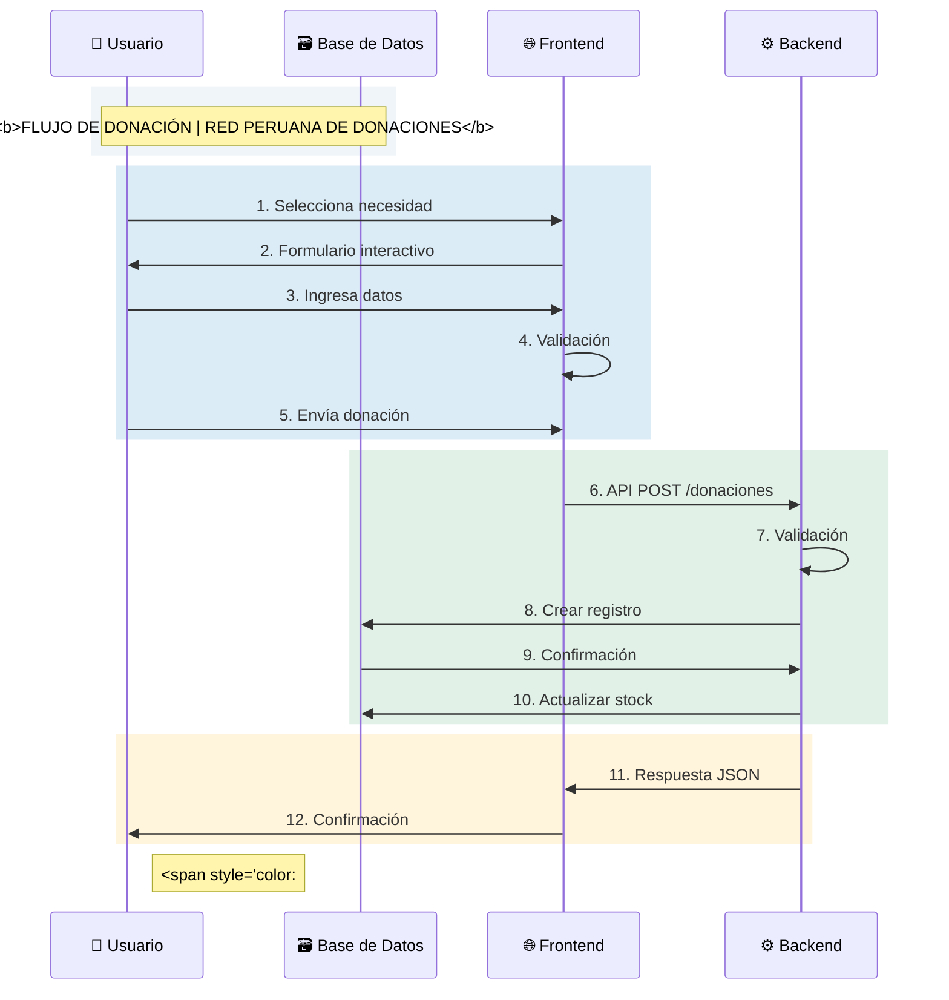

# **Red Peruana de Donaciones Comunitarias**  

La **Red Peruana de Donaciones Comunitarias** es una innovadora plataforma tecnológica diseñada para optimizar y democratizar la distribución de donaciones en las zonas más vulnerables del Perú, especialmente en áreas rurales y periféricas. Este proyecto busca conectar a **donantes, organizaciones sociales y comunidades necesitadas** en un mismo espacio digital, garantizando **transparencia, eficiencia y equidad** en el proceso de ayuda humanitaria.  


## **✨ Características ✨**  

✅ **Interfaz Animada y Moderna** – Diseño fluido con transiciones suaves para una experiencia de usuario premium.  
✅ **Acceso Multirol** – Perfiles personalizados para administradores, donantes y organizaciones.  
✅ **Seguimiento en Tiempo Real** – Visualización animada del recorrido de las donaciones hasta su destino final.  
✅ **Informes Detallados** – Gráficos interactivos y reportes automatizados para mayor transparencia.  
✅ **Notificaciones Dinámicas** – Alertas en tiempo real para donaciones recibidas y entregadas.  

🔗 **Visita la plataforma:** [https://donaciones-comunitarias.wuaze.com](https://donaciones-comunitarias.wuaze.com)  

📌 **Credenciales de Acceso:**  
- **Admin:** `admin@donaciones.com` | Contraseña: `123456789`  
- **Donante:** `donante@ejemplo.com` | Contraseña: `123456789`  
- **Organización:** `org@ejemplo.com` | Contraseña: `123456789`  

 


### Para organizaciones
- Registrar necesidades específicas (alimentos, ropa, materiales) con cantidades requeridas y fechas límite.

### Para donantes
- Explorar necesidades activas, realizar reservas de donaciones y llevar un historial.

### Para administradores
- Validar organizaciones, generar reportes y monitorear transacciones.

### Objetivos principales
1. Digitalizar el proceso de donaciones comunitarias
2. Reducir la duplicación de esfuerzos
3. Proporcionar trazabilidad completa de las transacciones
4. Fomentar la participación ciudadana en ayuda social


## Características Clave

### Gestión de Usuarios
- Registro y autenticación para 3 roles: Donante, Organización y Administrador
- Perfiles personalizados con historial de actividades
- Sistema de verificación para organizaciones

### Gestión de Necesidades
- CRUD completo para necesidades (Crear, Leer, Actualizar, Eliminar)
- Categorización por tipo (Alimentos, Ropa, Materiales Escolares)
- Filtros avanzados por ubicación, urgencia y categoría

### Sistema de Donaciones
- Reserva interactiva con confirmación en tiempo real
- Notificaciones por correo electrónico
- Generación de comprobantes digitales

### Panel Administrativo
- Dashboard con métricas clave
- Generación de reportes en PDF/Excel
- Herramientas de moderación y verificación

## Tecnologías Utilizadas

### Frontend
- 
- 
- 
- 

### Backend
- 
- 
- 
- 

### Herramientas
- 
- 
- 
- 

## Estructura del Proyecto

```
donaciones-comunitarias/
├── backend/                  # Lógica del servidor y API
│   ├── config/               # Configuración de la base de datos y otros parámetros
│   │   └── database.php      # Configuración de conexión a la base de datos
│   ├── controllers/          # Controladores principales del backend (MVC)
│   │   ├── AuthController.php         # Controlador de autenticación y sesiones
│   │   ├── DonacionController.php     # Controlador de donaciones
│   │   ├── NecesidadController.php    # Controlador de necesidades
│   │   ├── OrganizacionController.php # Controlador de organizaciones
│   │   └── ReporteController.php      # Controlador de reportes
│   ├── libs/                 # Librerías auxiliares
│   │   ├── Auth.php          # Lógica de autenticación
│   │   └── Database.php      # Clase de conexión a la base de datos
│   ├── models/               # Modelos de datos (MVC)
│   │   ├── Donacion.php
│   │   ├── Necesidad.php
│   │   ├── Organizacion.php
│   │   └── Usuario.php
│   └── routes/               # Definición de rutas backend
│       └── web.php
├── composer.json             # Dependencias PHP (Composer)
├── composer.lock             # Versión exacta de dependencias
├── config.php                # Configuración global del sistema
├── database/                 # Migraciones y seeders para la base de datos
│   ├── migrations/           # Scripts para crear tablas
│   │   ├── 001_create_users_table.php
│   │   ├── 002_create_organizaciones_table.php
│   │   ├── 003_create_necesidades_table.php
│   │   └── 004_create_donaciones_table.php
│   └── seeds/                # Datos de ejemplo para poblar la base de datos
│       ├── OrganizacionesSeeder.php
│       └── UsersSeeder.php
├── dcds.md                   # Documentación técnica y de desarrollo
├── error.log                 # Log de errores del sistema
├── frontend/                 # Frontend: vistas, assets y componentes
│   ├── assets/               # Recursos estáticos (CSS, JS, imágenes)
│   │   ├── css/
│   │   │   ├── bootstrap.min.css      # Bootstrap local
│   │   │   └── styles.css             # Estilos personalizados
│   │   ├── img/                       # Imágenes y logos
│   │   │   ├── ChatGPT.png
│   │   │   ├── hero-bg.jpg
│   │   │   ├── hero-image.png
│   │   │   └── logo.png
│   │   └── js/                        # Scripts JS personalizados
│   │       ├── auth.js
│   │       ├── donaciones.js
│   │       ├── main.js
│   │       ├── necesidades.js
│   │       └── usuarios.js
│   ├── index.php              # Página principal del frontend
│   ├── partials/              # Componentes parciales reutilizables
│   │   ├── footer.php
│   │   ├── header.php
│   │   ├── navbar.php
│   │   └── scripts.php
│   └── views/                 # Vistas principales por módulo y rol
│       ├── 404.php            # Página de error 404
│       ├── home.php           # Página de inicio
│       ├── necesidades.php    # Listado público de necesidades
│       ├── admin/             # Vistas para el rol administrador
│       │   ├── dashboard.php
│       │   ├── donaciones.php
│       │   ├── donaciones_estado.php
│       │   ├── organizaciones.php
│       │   ├── organizaciones_verificar.php
│       │   ├── perfil.php
│       │   └── reportes.php
│       ├── auth/              # Vistas de autenticación
│       │   ├── login.php
│       │   ├── logout.php
│       │   └── register.php
│       ├── donante/           # Vistas para el rol donante
│       │   ├── dashboard.php
│       │   ├── donar.php
│       │   ├── donaciones.php
│       │   ├── historial.php
│       │   └── perfil.php
│       └── organizacion/      # Vistas para el rol organización
│           ├── dashboard.php
│           ├── DonacionesRecibidas.php
│           ├── historial.php
│           ├── necesidades.php
│           ├── necesidades_crear.php
│           ├── necesidades_editar.php
│           ├── necesidades_eliminar.php
│           ├── perfil.php
│           └── donaciones/
│               └── actualizar.php
├── README.md                  # Documentación principal del proyecto
```


### Flujo



## Instalación Local

### Requisitos Previos
- XAMPP/WAMP/MAMP (Apache, MySQL, PHP)
- PHP 8.0+
- MySQL 8.0+
- Composer (para dependencias PHP)
- Node.js (opcional para assets)

### Pasos de Instalación

1. Clonar el repositorio:
```bash
git github.com:cajatazo/donaciones-comunitarias.git
cd donaciones-comunitarias
```

2. Configurar entorno:
```env
DB_HOST=localhost
DB_NAME=donaciones_db
DB_USER=root
DB_PASS=
```

3. Instalar dependencias:
```bash
composer install
```

4. Configurar base de datos:
```bash
mysql -u root -p < database/script_initial.sql
```

5. Iniciar servidor:
```bash
# Mover proyecto a carpeta `htdocs` de XAMPP
# Acceder via: http://localhost/donaciones-comunitarias
```

## Configuración de Base de Datos

| Tabla            | Campos principales                                  |
|------------------|----------------------------------------------------|
| `usuarios`       | id, email, password, rol, estado                   |
| `organizaciones` | id, nombre, RUC, direccion, telefono               |
| `necesidades`    | id, org_id, titulo, descripcion, categoria         |
| `donaciones`     | id, necesidad_id, donante_id, cantidad, estado     |

## Despliegue en Producción

### Opción 1: Hosting Compartido
1. Subir archivos via FTP
2. Crear base de datos MySQL en cPanel
3. Importar script SQL
4. Configurar `.env` con credenciales del hosting

### Opción 2: VPS (Recomendado)
```bash
sudo apt update
sudo apt install apache2 mysql-server php libapache2-mod-php php-mysql
sudo chown -R www-data:www-data /var/www/donaciones-comunitarias
```

### Variables de Entorno Críticas
```env
APP_ENV=production
APP_DEBUG=false
MAIL_HOST=smtp.gmail.com
MAIL_USER=correo@dominio.com
MAIL_PASS=tu-contraseña-segura
```


## Capturas de Pantalla


## Licencia

Este proyecto está bajo la licencia **MIT**. Consulta el archivo [LICENSE](LICENSE) para más detalles.

> "La solidaridad no es un acto de caridad, sino una ayuda mutua entre fuerzas que luchan por el mismo objetivo."
> 
> - Samora Machel

## Contacto

Para preguntas o colaboraciones:

- ✉️ [jescampomanesza@uch.pe](mailto:jescampomanesza@uch.pe)


